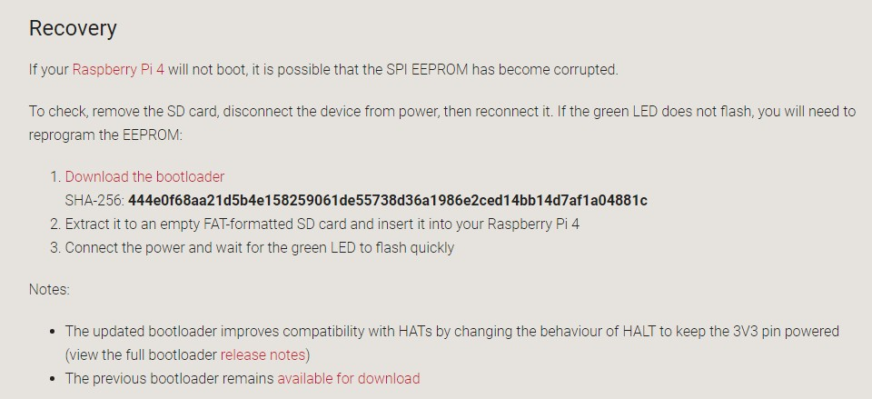

# Pi4 Bootload的更新

## 前因

Pi4的板子上，有一个BOIS芯片用于存储系统启动的一些程序和信息。上市之后，官方发现有一部分Pi4无法启动，或者在使用一段时间后，因非法断电，导致BOIS芯片内信息丢失，从而Pi4无法再次启动。所以树莓派基金会在官方网页提供了补救措施[ https://www.raspberrypi.org/downloads/ ]( https://www.raspberrypi.org/downloads/ ) 

*注意：Pi1-Pi3都不需要升级。* 

## 升级后的优点

* 修复EEPROM变砖问题。
* 解决HAT版兼容性，比如：GPIO 3.3V掉电的问题。
* 减少USB 3.0 接口功耗问题。 *2019.9.10日发布的bootload更新*

## 开干

准备工具：

* TF空白卡一张（8-32G）。*64G不行,具体原因见视频！*
* 如不具备以上条件，那就用一张已做好Raspbian系统的卡。容量不限制。只要能启动系统就可以！

操作见视频。

* 下载rpi-boot-eeprom-recovery-xxx.zip
* 解压缩到FAT32分区
* 插入Pi4，上电！等10秒钟
* 关机，删除刚才COPY进去的bootload文件！