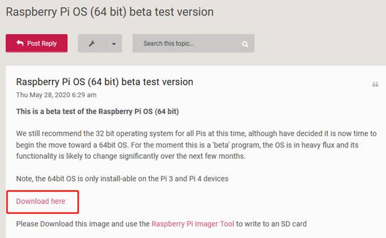

# 树莓派8GB的开箱和64位系统的刷写


### Pi4的历史：

在2019年6月的时候，树莓派基金会就发布了Pi4 1GB 、2GB、4GB 3个版本，然后细心的小伙伴去当时印刷的说明书上，还有一个8GB的版本没有发布。

为什么8GB没有发布？？UP去国外查了相关的资料。实际是8GB单颗粒内存的缺货导致的。所以基金会一直没有把8GB批量投放市场。到了今年5月28日，基金会突然向全世界玩家发布了8GB这个型号。然后还同时发布了64bit系统。因为之前的Raspbian系统，一直都是32位的天下。而如今Pi4的CPU已经非常强悍，在配上8GB内存，去跑32位的系统和应用，性能无法全部释放出来。

虽然UP做这期视频的时候，基金会官宣的系统还是Raspberry Pi OS 32bit。保不齐过不了多久，就会官宣上架64Bit的系统了。


### 优势

国外评测结果： https://hackaday.com/2020/01/28/raspberry-pi-4-benchmarks-32-vs-64-bits/ 


### 下载途径

* 官方网站

  首先要去check的地址是：  https://www.raspberrypi.org/downloads/raspberry-pi-os/ 

  这里是基金会发布最新稳定版系统的唯一途径。目前2020.6.17日，还只有32bit的稳定版本。所以我们要pass这个网址。

* 官方论坛

  其次想要下载beta版本的系统，可以访问 https://www.raspberrypi.org/forums/viewtopic.php?f=117&t=275370 这个网址。

  ​          


### 烧写过程

可以查看up的往期视频：  https://www.bilibili.com/video/BV1hE411y7ag/ 


### 如何验证64位系统

* 系统验证

```
uname -a

getconf LONG_BIT
```

  

* 应用程序验证

```
file /bin/ls

file /bin/cp

file /bin/bash

file /bin/mv
```

  


